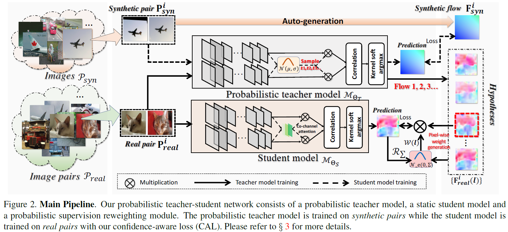
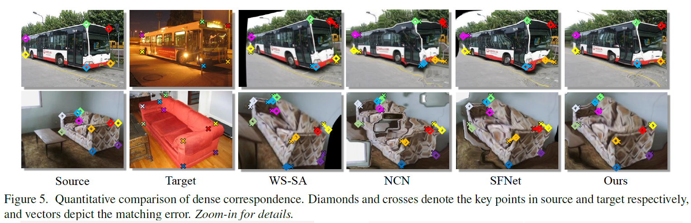

#  Probabilistic Model Distillation for Semantic Correspondence (CVPR2021)

> Authors:
> [Xin Li](https://scholar.google.com/citations?user=TK-hRO8AAAAJ&hl=en), 
> [Deng-Ping Fan](https://dpfan.net/), 
> [Fan Yang](https://scholar.google.com/citations?user=FSfSgwQAAAAJ&hl=en), 
> [Ao Luo](), 
> [Hong Cheng](https://scholar.google.com/citations?user=-845MAcAAAAJ&hl=zh-CN), 
> [Zicheng Liu](https://scholar.google.com/citations?user=bkALdvsAAAAJ&hl=en).



1. Configuring your environment (Prerequisites):
    The training and testing experiments are conducted using [PyTorch](https://github.com/pytorch/pytorch).   
    
    Note that PMDNet is only tested on Ubuntu OS with the following environments. 
    It may work on other operating systems as well but we do not guarantee that it will.
    
<!--2. Downloading Testing Sets: -->
2. Downloading Testing Sets:
    + downloading _**PF-PASCAL and PASCAL-WILLOW dataset**_ (Please use download_dataset.py in "data" directory).
    + downloading [SPair-71K Dataset](http://cvlab.postech.ac.kr/research/SPair-71k/data/SPair-71k.tar.gz)

3. Testing Configuration:
    + After you download all the trained models [Google Drive link](https://drive.google.com/file/d/1N7sW5cecKcq9O5nYhjmZWJ_o9rWpy5h1/view?usp=sharing) or [Baidu Pan link](https://pan.baidu.com/s/1lczvoYWMLTjhy-ZZ2__HCQ) with the fetch code: pfk8, move it into './models/', and testing data.
    + Playing 'eval_<dataset_name>.py'. e.g. eval_willow for PASCAL-WILLOW dataset.


4. Training:
   + Training code will come soon.
6. If you think this work is helpful, please cite

```
@inproceedings{zhai2021Mutual,
  title={Probabilistic Model Distillation for Semantic Correspondence},
  author={Li, Xin and Fan, Deng-Ping and Yang, Fan and Luo, Ao and Cheng, Hong and Liu, Zicheng},
  booktitle={Proceedings of the IEEE/CVF Conference on Computer Vision and Pattern Recognition},
  pages={},
  year={2021}
}
```
